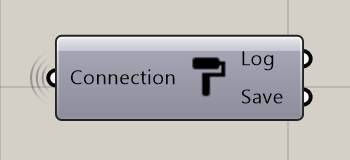

******************
PublishMaterial
******************

**Input**

=========== =============================== ===========
Name        Description                     Type
=========== =============================== ===========
Connection  Link with the Connect component Connection
=========== =============================== ===========

**Output**

=======     ==================================  ==============
Name        Description                         Type
=======     ==================================  ==============
Log         Documents changes & Data send       Text
Save        Connect to SaveContent for saving   Radii content
=======     ==================================  ==============

Note:

  - in case your custom material remains black, try changing the color profile of the image in use to RGB