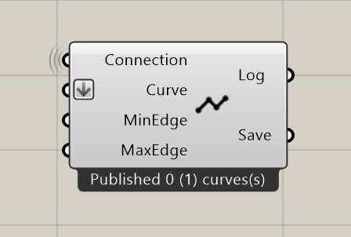

*************
PublishCurve
*************

**Input**

==========  ======================================  ==============
Name        Description                             Type
==========  ======================================  ==============
Connection  Link with the Connect component         Connect
Curve       the curves to publish                   Curve
MinEdge     Min length of segments                  Number
MaxEdge     Max length of segments                  Number
==========  ======================================  ==============

**Output**

==========  ======================================  ==============
Name        Description                             Type
==========  ======================================  ==============
Log         Documents changes & Data send           Text
Save        Connect to SaveContent for saving       Radii content
==========  ======================================  ==============

*Option:* The line weight can be controlled by setting it in the rhino layer or directly on the object, after baking the curves.

Tip: Be Careful with the max and min edge length, it can create a lot of data if the values are too small.
Lines are not very efficient geometry, they can slow down the model if there are a lot of them.

